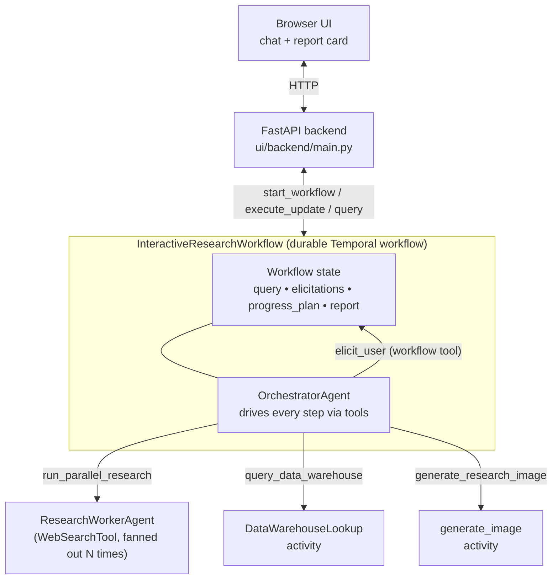

# Temporal Interactive Deep Research Demo (OpenAI Agents SDK)

A demo of an agentic deep-research workflow built on
[Temporal](https://temporal.io) and the
[OpenAI Agents SDK](https://github.com/openai/openai-agents-python). A single
orchestrator agent runs inside a Temporal workflow and drives the entire
research loop — clarifying questions, parallel research sub-agents,
proprietary-data lookup, image generation, and a final markdown report — by
calling tools.

This repository builds on the original
[Temporal Interactive Deep Research demo by @steveandroulakis](https://github.com/steveandroulakis/openai-agents-demos)
and has since diverged toward an agentic structure suitable for talks and
live demos. See [CHANGELOG.md](CHANGELOG.md) for the diff against the
upstream snapshot.

## Architecture



- **Workflow** (`openai_agents/workflows/interactive_research_workflow.py`):
  durable state — original query, pending elicitation, completed elicitations,
  current activity, progress plan, final report. Every user input is delivered
  via a Temporal workflow update; every status read is a query.
- **Orchestrator agent** (`openai_agents/workflows/research_agents/orchestrator_agent.py`):
  the only LLM-driven decision-maker. Required Pydantic-typed tool arguments
  enforce step ordering structurally; the orchestrator emits a structured
  `FinalizeReportRequest` as its terminal action.
- **Research worker** (`openai_agents/workflows/research_agents/research_worker_agent.py`):
  the orchestrator fans this small sub-agent out via `WebSearchTool` for each
  parallel subquery.
- **Activities**: `enterprise_data_activities.py` (proprietary data lookup
  with retry-recoverable failure injection) and `image_generation_activity.py`
  (gpt-image generation, with a cached fast-path for repeatable demos).
- **FastAPI backend** (`ui/backend/main.py`): a thin HTTP layer that starts
  workflows, forwards updates and queries, and serves the static frontend.
- **Frontend** (`ui/index.html`): vanilla-JS chat UI that polls the workflow
  for state and renders a report card on completion.

## Prerequisites

- Python 3.10+
- [`uv`](https://docs.astral.sh/uv/getting-started/installation/) for dependency
  management
- A Temporal server — either `temporal server start-dev` locally on
  `127.0.0.1:7233` (the default) or [Temporal Cloud](https://temporal.io/cloud)
- An [OpenAI API key](https://platform.openai.com/api-keys) with access to
  `gpt-5` and `gpt-image-1` (the orchestrator model and image model are
  configurable via env vars; see `openai_agents/workflows/research_agents/orchestrator_agent.py`)

## Setup

```bash
# 1. Install dependencies
uv sync

# 2. Copy and edit the env file
cp .env-sample .env
$EDITOR .env  # at minimum, set OPENAI_API_KEY

# 3. Start a local Temporal dev server (in its own terminal)
temporal server start-dev
```

To use Temporal Cloud instead, uncomment `TEMPORAL_PROFILE=cloud` in `.env`
and run:

```bash
temporal config set --profile cloud --prop address   --value "<your-cloud-address>"
temporal config set --profile cloud --prop namespace --value "<your-namespace>"
temporal config set --profile cloud --prop api_key   --value "<your-api-key>"
```

See [Temporal environment configuration](https://docs.temporal.io/develop/python/environment-configuration)
for details.

## Running the demo

Three terminals:

```bash
# Terminal 1: worker
uv run openai_agents/run_worker.py
#   or, with the demo-friendly defaults baked in:
bash scripts/start-clean-worker

# Terminal 2: FastAPI backend + static frontend
uv run ui/backend/main.py
#   serves http://127.0.0.1:8234

# Terminal 3: Temporal dev server (if not running already)
temporal server start-dev
#   Temporal UI: http://localhost:8233
```

Open <http://127.0.0.1:8234> in a browser, ask a research question, answer
the two clarifying questions, and watch the workflow run through to a final
markdown report. The Temporal UI shows the workflow history side-by-side.

The full end-to-end run takes 1–3 minutes depending on web-search latency
and which failure-injection beats are enabled.

## Demo helpers

The `scripts/` directory contains presentation helpers, not production
patterns:

- `start-clean-worker [name]` — start a worker with the recording-friendly
  defaults baked in. Pass a name to run multiple instances in parallel
  behind the same task queue.
- `crash-worker [name]` — SIGKILL a named worker. Used during the
  failure-recovery beat to demonstrate that Temporal resumes the workflow
  on a fresh worker without losing state.
- `stop-demo-workers` — graceful shutdown of all worker instances tracked
  by `.demo-worker*.pid`.
- `check-ports` — quickly check who's listening on 7233 / 8233 / 8234.
- `show-history <workflow-id>` — pretty-printed activity / failure /
  completion event timeline from `temporal workflow show`.
- `demo-status <workflow-id>` — hit the backend status and result endpoints
  for a workflow.

The `DEMO_*` environment variables in `.env-sample` control how aggressive
the failure injection is. The shipped defaults are recording-clean (no
crashes, fast warehouse). Flip them on for the failure-recovery moment —
see the next section.

## Failure injection

The `DataWarehouseLookup` activity is the place where Temporal's recovery
behavior shines. Two demo knobs in `.env` (or in the worker's environment)
control how it misbehaves:

| Env var | What it does |
| --- | --- |
| `DEMO_DATA_WAREHOUSE_RETRY_FAILURES` | Number of attempts that fail before the activity succeeds. `0` = always succeed on attempt 1. `8` = attempts 1–8 fail, attempt 9 succeeds. |
| `DEMO_DATA_WAREHOUSE_FIRST_ATTEMPT_SECONDS` | Latency of attempt 1 only. `1s` is brisk; `8s` gives you time to SIGKILL the worker mid-attempt. |

Defined in `openai_agents/workflows/enterprise_data_activities.py`. The
activity's retry policy (4-second fixed backoff, max 10 attempts) lives in
`openai_agents/workflows/research_agents/orchestrator_agent.py`.

### Recipe A — recoverable activity failure

Temporal retries the activity in place. The audience sees N failed attempts
in the workflow history, ~4s gaps between them, and then a successful
attempt that lets the workflow continue without rerunning earlier work.

Either edit `.env` (the worker reads it via `load_dotenv()`):

```bash
DEMO_DATA_WAREHOUSE_RETRY_FAILURES='8'
DEMO_DATA_WAREHOUSE_FIRST_ATTEMPT_SECONDS='1'
```

…or `export` the values in the shell that starts the worker:

```bash
export DEMO_DATA_WAREHOUSE_RETRY_FAILURES='8'
export DEMO_DATA_WAREHOUSE_FIRST_ATTEMPT_SECONDS='1'
bash scripts/start-clean-worker
```

One worker is enough.

What to highlight in the Temporal UI:

- The workflow's pending activity stays as `DataWarehouseLookup` for ~32s.
- Click the activity → **Pending Activities** shows attempt count climbing
  and the `lastFailure` message: *"Simulated remote connection reset…"*.
- The earlier completed events (clarifications, search summaries) are
  unchanged. The retry only re-runs the failing activity.
- After attempt 9 the activity completes and the workflow proceeds.

### Recipe B — worker death mid-flight

Temporal moves the in-flight activity to a different worker. The audience
sees the activity stall when the worker dies, then resume on a fresh worker
without losing earlier state.

Either edit `.env`:

```bash
DEMO_DATA_WAREHOUSE_RETRY_FAILURES='0'
DEMO_DATA_WAREHOUSE_FIRST_ATTEMPT_SECONDS='8'
```

…or export in each worker's shell:

```bash
export DEMO_DATA_WAREHOUSE_RETRY_FAILURES='0'
export DEMO_DATA_WAREHOUSE_FIRST_ATTEMPT_SECONDS='8'
```

Then start two workers behind the same task queue:

```bash
bash scripts/start-clean-worker        # writes .demo-worker-clean.pid
bash scripts/start-clean-worker 2      # writes .demo-worker-clean-2.pid
```

Run the demo and watch the workflow until the data-warehouse activity
starts (the orchestrator emits `query_data_warehouse`). While the 8-second
attempt is in flight, kill whichever worker picked it up:

```bash
bash scripts/crash-worker     # kills .demo-worker-clean.pid
# or
bash scripts/crash-worker 2   # kills .demo-worker-clean-2.pid
```

What to highlight in the Temporal UI:

- The activity's `lastHeartbeat` ages while the dead worker has the lock.
- The schedule-to-close timeout (300s on this activity) ensures Temporal
  reassigns it well before the workflow gives up.
- The activity reappears as `Started` on the other worker; previously
  completed events stay completed.

### Inspecting after the fact

```bash
bash scripts/show-history <workflow-id>
```

Prints a TSV of activity-scheduled / started / failed / completed events,
the attempt counter, and the failure message — handy for stepping through
what Temporal actually did.

`.env-sample` has the same recipes inline as a quick reference.

## Development

```bash
# Lint
uv run ruff check --select F401,F841

# Type check
uv run pyright .
```

## Attribution

Original work © Steve Androulakis. Substantial enhancements for the
agentic structure by Johann Schleier-Smith — see [CHANGELOG.md](CHANGELOG.md)
for the per-area summary and `git log` for the per-commit history.

## License

MIT — see [LICENSE](LICENSE).
